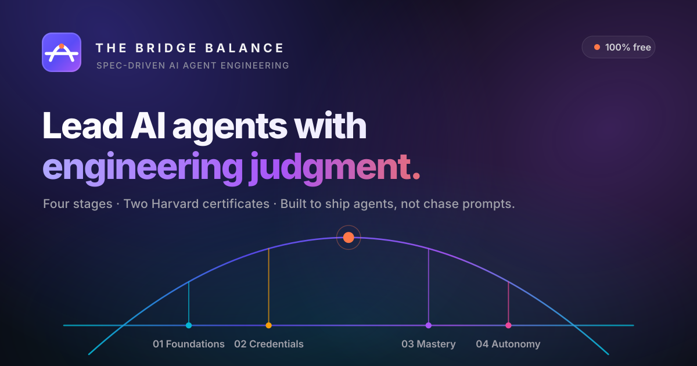

<p align="center">
  
</p>

<h1 align="center">The Bridge Balance</h1>

<p align="center">
  <b>Student-oriented platform for spec-driven AI agent engineering.</b><br>
  4 stages · 2 Harvard certificates · 100% free
</p>

<p align="center">
  
  
  
  
  
  
  
</p>

<p align="center">
  <a href="#-whats-here">What's here</a> •
  <a href="#-project-status">Status</a> •
  <a href="#-quickstart">Quickstart</a> •
  <a href="#-stack">Stack</a> •
  <a href="#-where-to-start">Where to start</a> •
  <a href="#-conventions">Conventions</a> •
  <a href="#-contributing">Contributing</a>
</p>

---

This repo is the **spec-driven development** workspace for **The Bridge Balance**. The platform itself is a Docusaurus textbook paired with a FastAPI backend and a paid catalog of Claude Code sub-agents, skills, MCP servers, and plugins.

## 📦 What's here

```
.
├── edu-site/              # the textbook (Docusaurus) + the backend (FastAPI)
│   ├── docs/              # MDX curriculum content (Stage 1–4)
│   ├── src/               # Docusaurus theme + pages
│   └── api/               # FastAPI app (RAG chat, products, auth)
├── specs/                 # Feature specs (Spec-Kit Plus)
│   └── 001-book-foundation/  … 005-redesign-navbar-hero/
├── history/               # PHRs and ADRs
│   ├── prompts/           # Prompt History Records
│   └── adr/               # Architecture Decision Records
├── .specify/              # Spec-Kit Plus templates + scripts
├── .claude/commands/      # /sp.* slash commands
├── CLAUDE.md              # Agent project rules
├── stack.md               # Source-of-truth stack reference
└── README.md              # ← you are here
```

## 🚦 Project status

**Phase A** (curriculum live) — in progress now.

| Workstream | Status | Notes |
|---|:---:|---|
| Docusaurus book | ✅ scaffolded | 6 Stage 1 chapters as MDX shells; Stages 2–4 indexed |
| FastAPI backend | ✅ scaffolded | `/health` works; Phase B routes return 501 |
| LLM provider abstraction | ✅ shipped | Default `none` — refuses to spend money |
| Free-tier services | ✅ documented | Neon + Qdrant + Groq/Gemini + R2 + Inngest |
| Lecture content | ⏳ pending | You deliver; text is the second medium after video |
| RAG chat | 🔜 Phase B | Qdrant + LLM + embeddings wiring |
| Translation / personalization | 🔜 Phase B | Per-chapter buttons |
| Auth | 🔜 Phase B | better-auth.com |
| Payments | 🔜 Phase C | Stripe + R2 + Resend |
| Paid product catalog | 🔜 Phase C | Sub-agents, skills, MCP, plugins |

Legend: ✅ done · ⏳ in progress · 🔜 planned

## ⚡ Quickstart

<table>
<tr>
<td valign="top" width="50%">

**📚 Run the book**

```bash
cd edu-site
npm install
npm start
# → http://localhost:3000
```

Requires **Node 18+**.

</td>
<td valign="top" width="50%">

**⚙️ Run the backend**

```bash
cd edu-site/api
python -m venv .venv
source .venv/bin/activate
pip install -e ".[dev]"
cp .env.example .env
uvicorn app.main:app --reload --port 8000
# → http://localhost:8000/docs
```

Requires **Python 3.12+**.

</td>
</tr>
</table>

Phase A runs the backend with **no credentials at all** — `/health` returns 200, `/llm/status` shows `provider=none`, and the Phase B routes return 501 with a "wired in Phase B" message.

## 🧱 Stack

15 components, every one on a free tier until usage justifies a paid tier.

| Layer | Tech |
|---|---|
| Frontend | Docusaurus (TypeScript, MDX) |
| Backend | FastAPI (Python 3.12) + SQLAlchemy/Alembic |
| Database | Neon Serverless Postgres |
| Vector search | Qdrant Cloud |
| LLM + embeddings | OpenAI SDK (pluggable, off by default) |
| Auth / payments | better-auth.com / Stripe |
| Storage / email / jobs | Cloudflare R2 / Resend / Inngest |

See [`stack.md`](./stack.md) for the full reference, runtime diagram, and free-tier cost ceiling.

## 🧭 Where to start

1. **Read a feature spec:** [`specs/001-book-foundation/`](./specs/001-book-foundation/) is the foundational one.
2. **Understand the stack:** [`stack.md`](./stack.md).
3. **See architectural decisions:** [`history/adr/`](./history/adr/).
4. **Run the book:** `cd edu-site && npm install && npm start`.
5. **Next workflow step:** once you're ready to define a feature formally, run `/sp.specify <feature>` (the slash command is wired at `.claude/commands/sp.specify.md`).

New to Git and GitHub? See [`CONTRIBUTING.md`](./CONTRIBUTING.md#-new-to-git-and-github) for a beginner-friendly walkthrough.

## 📐 Conventions

- **Spec-Driven Development.** Every feature starts as a spec → plan → tasks → implement. See [`specs/README.md`](./specs/README.md).
- **Prompt History Records.** Every meaningful exchange with the AI is recorded at `history/prompts/`.
- **ADRs.** Architectural decisions are documented at `history/adr/` after user consent (never auto-created).
- **Smallest viable change.** No unrelated edits. No invented APIs.
- **Free-tier by default.** New components MUST be on a free tier unless the platform has paying users to justify the cost.

## 🤝 Contributing

Issues and PRs are welcome — see [`CONTRIBUTING.md`](./CONTRIBUTING.md) for the workflow, branch conventions, and how CI checks your change. Please also read the [Code of Conduct](./CODE_OF_CONDUCT.md).

## 📄 License

TBD — a license will be added once the split between the open curriculum and the paid product catalog is finalized.

## 🌉 Free-forever guarantee

The curriculum is 100% free. Every backing service runs on a free tier by default — see [ADR-0001](./history/adr/0001-free-tier-llm-choice.md) for the free-tier LLM provider decision.

---

<p align="center"><i>Built with Spec-Driven Development, one small verifiable step at a time.</i></p>
