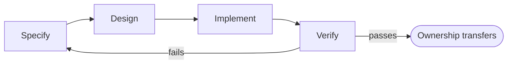

# The Bridge Between Code and Engineering

AI has made implementation cheap. Engineering still decides what should be built, what may be changed, how failure is contained, and who owns the result. The 2025 evidence is unambiguous: Stack Overflow's developer survey found 84% adoption but only 29% trust; METR's productivity study found experienced developers 19% slower on complex tasks while 63% reported spending more time debugging AI-generated code; Veracode's GenAI Code Security Report found that AI-generated code introduces vulnerabilities in 45% of cases. The discipline that bridges this is **Spec-Driven Engineering**: the engineer specifies intent and boundaries, the AI implements within them, and a human verifies before ownership.

## Map responsibility across the engineering loop

A 2025 study from METR — a research organisation measuring AI capability and its real-world effects — found something the industry absorbed far too calmly.

AI tools made experienced developers **19% slower** on complex tasks. Not slower-feeling. Slower, measured — while the work felt *easier* as they did it.

The same study found **63% of developers** reported spending more time debugging AI-generated code than they estimated writing it from scratch would have taken.

Read those two numbers together and a pattern appears that either one alone would hide. **AI contributes real value at some parts of a task and quietly imposes real cost at others.** Fail to track which is which, and the feeling of speed masks an actual net slowdown.

This version gives you the tracking tool: a map of which responsibilities stay yours however capable your assistant becomes — and which are genuinely safe to hand over.

### The four-stage loop, and who does what

Strip software work to its skeleton and it moves through four stages, AI or no AI. You **specify** what needs to happen. You **design** how it will happen. You **implement** the design. You **verify** that what you built does what you specified.

AI can contribute at every one of those stages. *Contribution is not ownership* — and collapsing that distinction is exactly where the METR numbers come from.

| Stage | Human responsibility | AI contribution |
|---|---|---|
| **Specify** | Define intent, constraints, risks, and acceptance checks | Ask clarifying questions and reveal omissions you hadn't considered |
| **Design** | Choose boundaries, interfaces, and failure behavior | Offer alternative approaches and draft structures |
| **Implement** | Decide what may change and inspect the diff | Generate and modify the actual code artifacts |
| **Verify** | Judge evidence, security, recovery readiness | Run checks and summarize results |

Read that table with attention on the left column, because it carries the weight.

At every stage the human responsibility is a **judgment** — defining, choosing, deciding, judging. At every stage the AI contribution is **execution** — asking, offering, generating, running. The pattern holds across all four rows deliberately.

The moment a "human responsibility" cell starts to look like something an AI could do unsupervised, the table has stopped describing this curriculum's claim and started describing full automation. That is a different claim, and — on the evidence below — not currently a justified one.

*The same four stages as the table above, shown as the loop they actually form — a failed verification sends the work back to Specify, not back to Implement, because a failed check usually means the requirement was wrong or incomplete, not just the code.*

### A common misreading of this table

The most common misapplication is reading the right-hand column as **permission to disengage**, rather than as a description of where value actually gets added.

*"AI contributes at the specify stage by asking clarifying questions"* does not mean the agent is specifying for you. It means a well-prompted agent can surface a gap in your own thinking — *what should happen if the export is requested for a user with zero rows?* — that you then have to resolve. **The contribution is a better question, not an answer you are excused from producing.**

The same misreading appears at Design. An agent proposing three architectural options slides quietly into "the agent designed this" the moment nobody notices that *choosing between the three* — the part requiring judgment about this system's constraints — still happened. It just happened implicitly, with nobody consciously making the call.

This is what produces METR's central, uncomfortable finding. Developers who felt faster because the AI was "handling" more of the loop were measurably **19% slower** on complex tasks. The felt speed came from skipping judgment steps, and the debugging cost of skipped judgment arrives later — outside the window where it feels like it is costing you anything.

### What each row looks like when it goes wrong

**Specify, skipped.** A developer prompts *add caching to this endpoint* and nothing more. The agent picks a caching strategy, a time-to-live, and an invalidation approach — all reasonable defaults, none chosen by anyone who understood this endpoint's traffic pattern or staleness tolerance.

Three weeks later, users report stale prices on a product page. Tracing it costs an afternoon and lands on a TTL nobody remembers choosing, because nobody chose it. It was inherited.

**Design, skipped.** An agent is asked to *make the API handle more traffic* and proposes a queue. The queue works.

Nobody asked what happens to a request if the queue itself goes down — because the design conversation, where a human decides what failure looks like and whether it is acceptable, never happened. The implementation is fine. The failure mode nobody chose is not.

**Implement, over-delegated.** The METR pattern in its purest form: a developer accepts a large, sprawling diff because reviewing it fully would take longer than the task felt like it deserved.

The 63% spending more time debugging than writing would have taken are disproportionately the ones who skipped a close read here — trading a fast first draft for a slow, confusing cleanup.

**Verify, treated as optional.** The code runs, the obvious case works, the change ships.

AWS research adds a related number: teams that switch across too many different AI tools and models deliver **40% less completed work** and see **double the defect rate** compared with teams that don't. That cost compounds when Verify is the first stage cut to recover lost time — which is exactly the wrong stage to cut, because **it is the only stage nothing else in the loop substitutes for.**

### Why tool-switching specifically erodes the loop

The AWS finding is worth a closer look, because "switching tools hurts productivity" undersells what's actually happening. Each AI coding tool and model has its own texture: its own tendency to over-explain or under-explain, its own default assumptions about error handling, its own quirks about what it treats as obvious versus what it flags for your attention. A developer working consistently with one tool builds an intuition for where that specific tool tends to be reliable and where it tends to need a closer look — which is itself a form of the verify-stage judgment this table is asking you to keep. Switch tools every few days, chasing whichever one had the best result on a benchmark this week, and that intuition never has time to form. You're back to treating every output as equally trustworthy by default, which is the exact state the 63%-debug-more figure describes.

This is also why the responsibility map above is deliberately built around stages and judgment rather than around any particular tool. A developer who has internalized "I own the specify and verify stages, regardless of which tool is doing the implementing" doesn't need to rebuild their process every time a new model ships. A developer who has instead built trust in a specific tool's specific behavior has, without quite meaning to, tied their judgment to something that's likely to change under them.

### A worked example: the loop applied to one real change

A concrete case. Your team needs an endpoint that lets users export their data as a CSV file.

**Specify — yours.** You write down that the export must exclude any field marked internal-only in the schema, must handle at least 100,000 rows without timing out, and must be rate-limited so it cannot be used to scrape the whole dataset repeatedly.

None of that is visible in the phrase "add a CSV export." That is the judgment turning a vague request into an actual specification.

**Design — yours, with the agent offering options.** You ask for two or three approaches to the large-row-count problem: stream the response, generate the full file in memory, or run a background job with a download link.

It offers genuine trade-offs. *You* decide which fits your traffic and infrastructure, because that decision rests on context the agent does not have and cannot reliably infer.

**Implement — the agent's, with you inspecting.** It writes the endpoint, the streaming logic, and the field filtering. You read the diff checking two specific things:

- Does the field filter match the internal-only list in the *current* schema — not a stale copy inferred from an older file the agent happened to read?
- Does the rate limit apply per-user rather than globally? Easy to get backwards, expensive to notice later.

**Verify — yours, with the agent assisting.** You run an export against a test account holding known internal-only fields and confirm none appear in the output. That is the check that catches the most damaging realistic failure: a data leak through a field that should never have left the server.

The agent can generate the test data, or write the test itself. Deciding that *this* is the test that matters, and confirming the result, stays yours.

### A second worked example, where the decision lives in Verify

The CSV export leaned on Specify and Implement. Here is one where the interesting judgment sits at the other end of the loop.

Your team's agent-assisted refactor of a payment-processing function **passes every existing test**, and the diff reads clean on inspection. No red flags. No obviously wrong logic.

The trap is treating *passes every existing test* as equivalent to *verified*. It isn't, and the gap is exactly where responsibility stays yours: **existing tests verify existing behaviour, not the specific risk introduced by this change.**

The real verify step asks what could go wrong that the current suite would not catch. For a payment function, the sharpest form of that question is usually about partial failure — a network timeout halfway through a multi-step transaction, a duplicate submission from someone who clicked twice.

Writing that one additional test, aimed at the risk *this* change introduces rather than at general correctness, is the verify-stage judgment no amount of AI assistance replaces. Deciding **which** failure mode matters most for **this** change is precisely the context-dependent call the table puts on the human side of the line.

<Callout type="warning" title="Safety floor">
An agent's output isn't yours to merge until you've verified it against your spec — ownership doesn't transfer just because the agent finished.
</Callout>

### The question this table is actually answering

With the map in front of you, the useful question is **not** *can AI do this stage*. For all four stages, increasingly, the honest answer is some version of yes.

The useful question is: **which responsibility am I deliberately retaining here, and why?**

That is a different question, and it is what METR's 19% finding is really pointing at. Developers who felt faster were often the ones who had stopped asking it — letting the AI's willingness to contribute at every stage quietly substitute for a decision about which stages still needed their judgment.

This table is also, deliberately, **not a permanent org chart.** Which specific tasks sit in "human responsibility" versus "safe to delegate more fully" shifts as your judgment about a codebase deepens and as the tools change.

What does not shift is the *shape*: four stages, judgment on the human side, execution on the AI side. That shape is what Spec-Driven Engineering describes — the engineer specifies intent and boundaries, the AI implements within them, and a human verifies before ownership.

### The map when you are the reviewer, not the author

One case the table above does not obviously cover: reviewing somebody *else's* agent-assisted change.

The instinct is to review the code. That is the wrong first move, because the code is the one part of the loop the agent is genuinely good at. **Review the stages the author was supposed to own.**

Three questions, in order, before you read a single line of the diff:

1. **What was specified?** If the pull request cannot tell you what the change was supposed to do — in the author's words, not the agent's summary — the Specify stage did not happen, and no amount of code reading will recover it.
2. **What design choice was made, and by whom?** If a queue, a cache, or a data structure appeared without a sentence explaining why that one, someone let the agent's first suggestion stand in for a decision.
3. **What was verified, specifically?** Not "tests pass." Which failure mode did the author decide mattered most here, and what evidence do they have that it does not occur?

If all three answers are present, the code review can be fast — the judgment already happened, and you are checking execution. If any is missing, **that is the review comment**, and it is a more useful one than anything you would have found reading the diff line by line.

### The same table at team scale

Everything above frames this as one developer applying a table to their own task. It applies at team scale too, and the failure modes get *harder* to see there, not easier.

A team lead who has personally internalised specify–design–implement–verify can still preside over a team where individual engineers have quietly stopped applying it. Aggregate velocity metrics look fine while verify-stage discipline erodes underneath them. The METR-style cost surfaces later, distributed across many small debugging sessions that never get traced to a common cause.

At team scale the question changes shape. Not *did I retain the right responsibilities on my task*, but:

> **For any given change, can we still tell who retained which responsibility?**

A pull-request template that asks explicitly what was specified and what was verified before review answers that structurally — instead of relying on every engineer remembering to apply the table unprompted. Structure beats memory here, because memory is the first thing a deadline takes.

### What this table is not

It is **not** a claim that AI will never be trustworthy enough to own more of the loop than it does today.

It is a claim about where the evidence currently sits: a 45% vulnerability rate in generated code samples, a 19% slowdown on complex tasks despite feeling faster, a 63% debugging-cost overrun. Those numbers describe the tools *now*. They are not a permanent ceiling, and treating them as one would be its own kind of resistance.

What does not depend on today's numbers is the discipline underneath: knowing explicitly which row you are currently trusting to the AI and which you are deliberately keeping. Hold that, and when the evidence shifts you are **adjusting a conscious decision** — rather than discovering, after an incident, that a decision had been made by default and nobody noticed.

### Where this sits in the curriculum

This responsibility map is **Stage 1** material — *Spec-Aware Vibe Engineering Foundations* — made concrete enough to apply to a task you have open right now.

- **Stage 2's** Harvard-certified coursework (CS50P, CS50W) pressure-tests whether your specify/design/verify judgment holds up *without* an AI implementation layer to lean on. That is a genuinely different test from anything this table alone can give you.
- **Stage 3** goes deep on directing the implementation stage itself — prompt, context, and loop engineering — once the boundary between *yours* and *delegated* is a habit rather than a fresh decision each time.
- **Stage 4** stretches this same four-row table across systems where several agents contribute to one pipeline, which is exactly where an unretained responsibility becomes hardest to trace to a decision point.

**What you can do next:** take one task you have open right now and label each of its four stages using this table. Write one sentence per stage naming what you — not the agent — are choosing to own, specific enough that a teammate reading it later would know exactly what you checked. If you cannot fill a row in honestly, that is the row where responsibility quietly slipped. Start there on the next task, before the same slip compounds into the debugging cost METR measured.

## Sources and fixed references

View all sources and links

- Jason Lemkin / SaaStr / Replit incident: [Ars Technica](https://arstechnica.com/information-technology/2025/07/ai-coding-assistants-chase-phantoms-destroy-real-user-data/) and [PCMag](https://www.pcmag.com/news/vibe-coding-fiasco-replite-ai-agent-goes-rogue-deletes-company-database).
- Andrej Karpathy's origin of "vibe coding": [ThreadReader](https://threadreaderapp.com/thread/1886192184808149383.html); Collins Dictionary [Word of the Year 2025](https://www.collinsdictionary.com/word-of-the-year/2025).
- Leonel Acevedo / Enrichlead: [Indie Hackers](https://www.indiehackers.com/post/tech/vibe-coding-has-a-security-problem-vLxyPTrTlZVwDo76oqvr).
- AI productivity and developer use: [METR](https://metr.org/) and [Stack Overflow Developer Survey 2025](https://survey.stackoverflow.co/2025/ai).
- AI-generated code security: [Veracode GenAI Code Security Report](https://www.veracode.com/blog/genai-code-security-report), 2025 and 2026 editions.
- Samsung policy change: [Bloomberg](https://www.bloomberg.com/news/articles/2023-05-02/samsung-bans-chatgpt-and-other-generative-ai-use-by-staff-after-leak).
- Stack Overflow AI-content policy: [Meta Stack Overflow](https://meta.stackoverflow.com/questions/421831/policy-generative-ai-e-g-chatgpt-is-banned).
- AWS research on AI-tool switching costs (40% less completed work, 2x defect rate for teams that switch across too many tools and models).
- Stanford Digital Economy Lab, "Canaries in the Coal Mine" (Brynjolfsson et al., November 2025) — early-career software developer employment data.
- Dice Tech Job Report 2025 and LinkedIn Workforce Report 2025 — entry-level posting and hiring-manager trust data.
- S&P Global AI Strategy Insights, January 2026 — "option paralysis is real."
- Anthropic, 2026 Agentic Coding Trends Report.
- Fortune 50 enterprise security-finding growth data, cited via SecurityWeek / Apiiro industry reporting.
- IBM and Cisco technical-debt budget allocation figures (20–30% of IT budgets toward AI-generated technical debt).
- Deloitte, *State of AI* 2026 — autonomous-agent governance maturity ("one in five companies").
- EU AI Act compliance timeline, obligations beginning August 2, 2026.
- BCMS, *Definitive 2026 Guide to Spec-Driven Development* — the three named SDD failure modes and "specification poverty."
- GitHub Blog, Spec Kit launch, 2025 — "we're moving from 'code is the source of truth' to 'intent is the source of truth.'"
- The Bridge Balance's own official curriculum documents (`problem_statement.md`, `solution_statement.md`, `curriculum_1.md`) — the source for all claims about the curriculum's own structure, stages, and rationale.

> *The bridge is built on specifications. The crossing is yours.*
